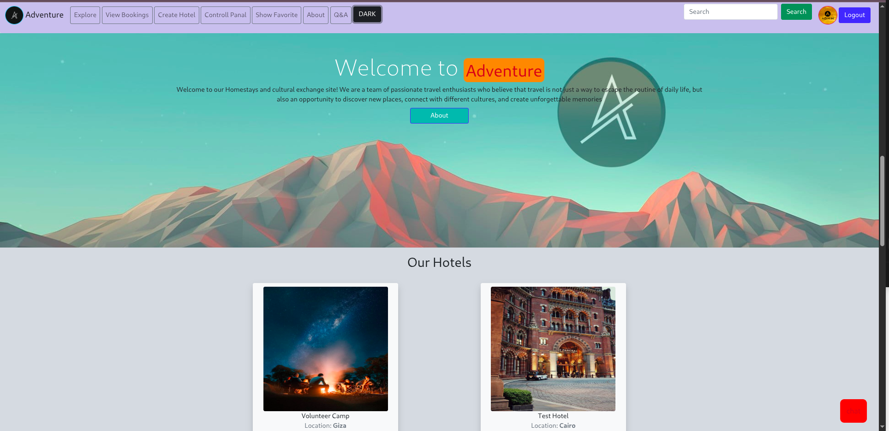

# 🚀 College PHP Project

This is a **PHP website project** created for college.  
It features a simple frontend and a PHP backend with full **CRUD functionality**.

---

## 🌟 Description
A simple CRUD website (Create, Read, Update, Delete) built to practice **PHP, HTML, CSS, and JavaScript**.  
User-friendly interface, perfect for learning basic web development concepts.

---

## ⚡ Features
- ✅ Add, edit, and delete data easily  
- ✅ Display data in a table  
- ✅ Clean and simple frontend  
- ✅ Works on local servers like **XAMPP** or **WAMP**  

---

## 🛠 Technologies Used
- **PHP**  
- **HTML / CSS / JavaScript**  
- **MySQL** (optional)  
- **XAMPP / WAMP**  

---

## 💻 Installation
1. Copy the project to your local machine  
2. Open **XAMPP** or any local server  
3. Place the files inside the `htdocs` folder  
4. Open your browser and visit:  
http://localhost/project_folder
5. Make sure the database is connected (if used)

---

## 📂 Project Structure

project_folder/
│
├─ assets/images/ # Images
├─ controller/ # Controller files
├─ views/ # Frontend pages
├─ utils.php # Helper functions
└─ index.php # Main page

---

## 🏆 Author
**Amr Eid**

---

 
 

